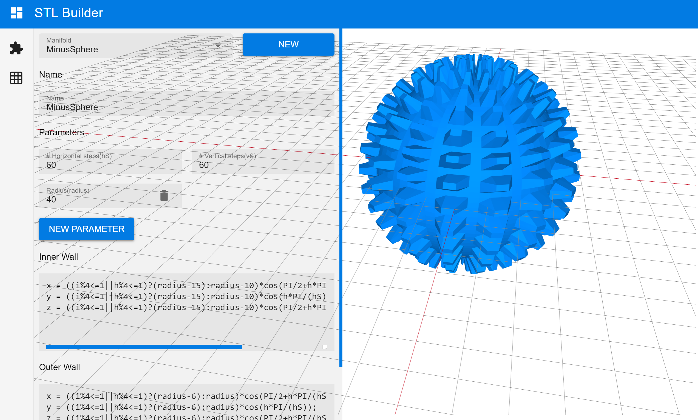
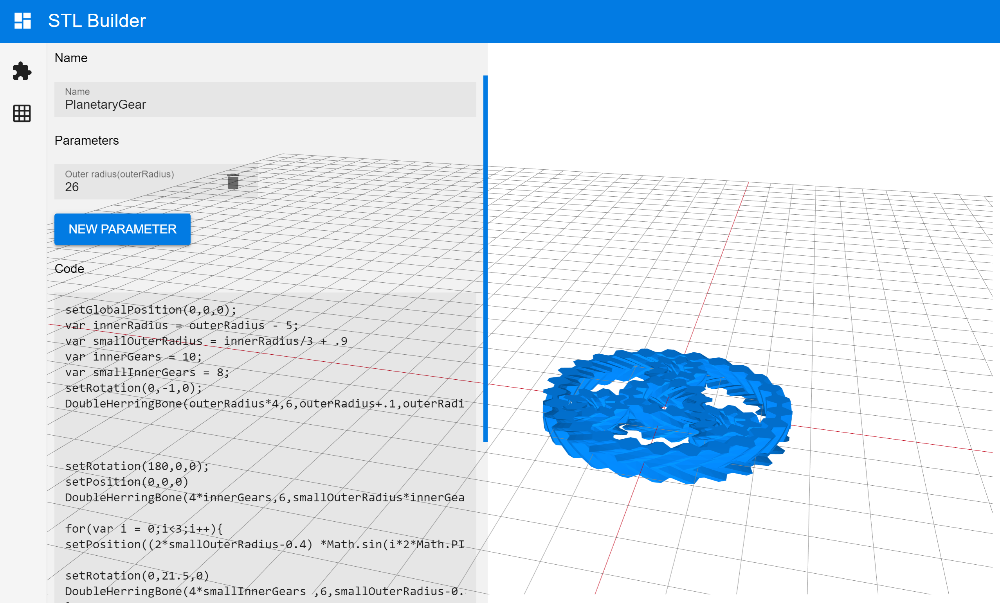
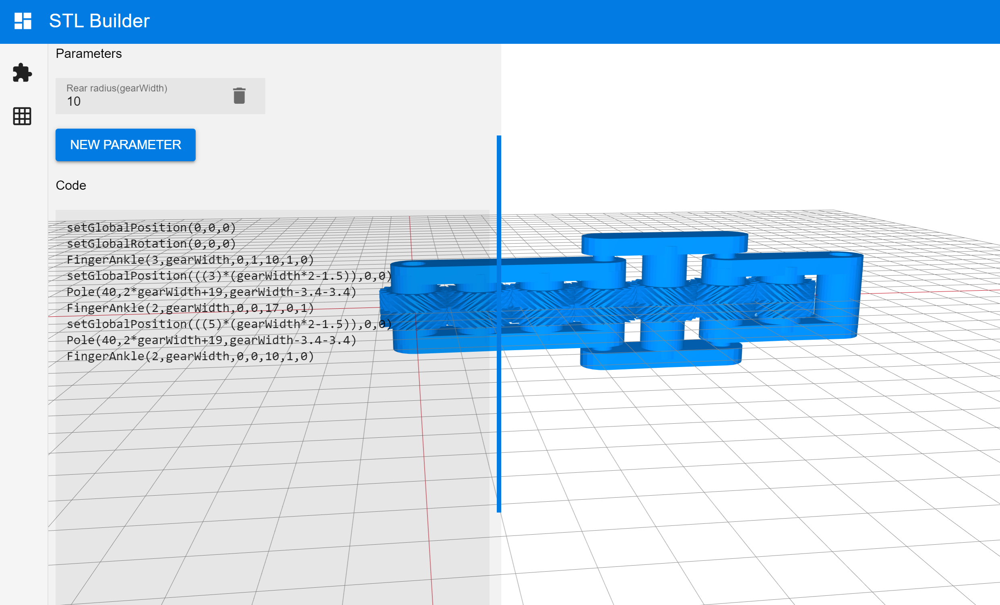

# STLBuilder
STLBuilder is a program that allows you to program 3D objects with Javascript. These objects can then be downloaded as STL.

This software depends mainly on vuejs, quasar-framework and threejs.

Running example: [LINK](https://codeaixtreme.de/stlbuilder/)

# Screenshots





# ToDo
- More examples
- Autocentering of objects
- Import of STL's


## Project setup
```
npm install
```

### Compiles and hot-reloads for development
```
npm run serve
```

### Compiles and minifies for production
```
npm run build
```
